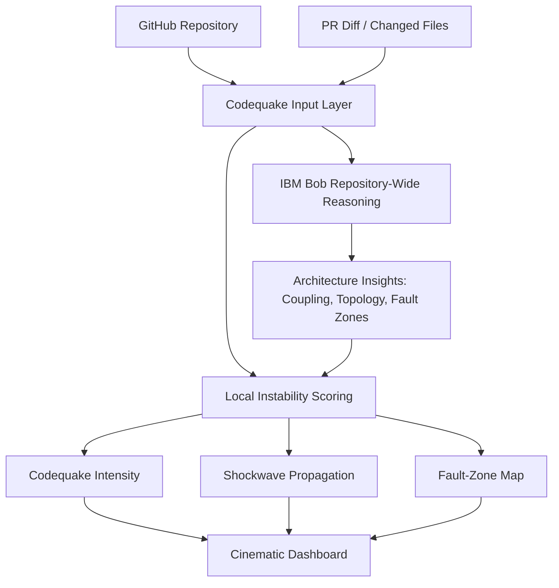

# Codequake

AI-powered architectural instability detection for software repositories, built for the IBM Bob Hackathon on lablab.ai.

Codequake uses IBM Bob's repository-wide reasoning capabilities to identify fault zones, dependency fragility, topology stress, and software shockwaves before they spread through a codebase.

## Positioning

Codequake is not a generic repository dashboard. It is an earthquake detection system for software architecture.

Old question: "What files could break?"

New question: "Where is architectural instability forming, and how could it spread through the system?"

## How IBM Bob Is Used

IBM Bob is the architecture reasoning engine behind Codequake.

In the intended workflow:

1. Codequake receives a GitHub repository URL and optional PR/diff.
2. IBM Bob analyzes the full repository architecture and dependency topology.
3. IBM Bob identifies fragile systems, tight coupling, propagation paths, and cascade risk.
4. Codequake combines Bob reasoning with local instability scoring.
5. The dashboard visualizes fault zones, shockwave propagation, Codequake intensity, and stability test targets.

The app includes `/api/bob`, a backend route that calls a configured IBM Bob endpoint when these environment variables exist:

```bash
IBM_BOB_API_URL=
IBM_BOB_API_KEY=
```

If the variables are not configured, the route returns demo reasoning so the proof-of-concept remains runnable.

## MVP Features

- GitHub repository input
- PR diff or changed-file input
- IBM Bob architecture reasoning workflow
- Instability Index and Codequake Intensity
- Fault-zone highlighting
- Shockwave propagation path
- Dependency topology visualization
- Architecture warnings and stability test targets
- Submission reminders for screenshots, Bob reports, commits, and demo clips

## Architecture



## Setup

```bash
npm install
npm run dev
```

On Windows PowerShell, if `npm` script execution is blocked, use:

```bash
npm.cmd install
npm.cmd run dev
```

## Demo Flow

1. Open Codequake.
2. Enter a repository URL and PR diff.
3. Click "Run IBM Bob reasoning" or paste exported Bob reasoning.
4. Show "Critical Architectural Event" detection.
5. Show dependency graph shockwaves and fault-zone cards.
6. Explain how IBM Bob translated repository-wide architecture reasoning into visible instability signals.
7. Close with: "Codequake visualizes software shockwaves before they spread."

## Submission Evidence Checklist

- Public GitHub repository
- Working proof-of-concept
- README.md
- MIT License
- Exported IBM Bob reports in `docs/bob-reports/`
- Screenshots in `docs/screenshots/`
- Demo video clips
- Presentation materials
- Documented IBM Bob usage
- Frequent commits and pushed changes

## License

MIT
